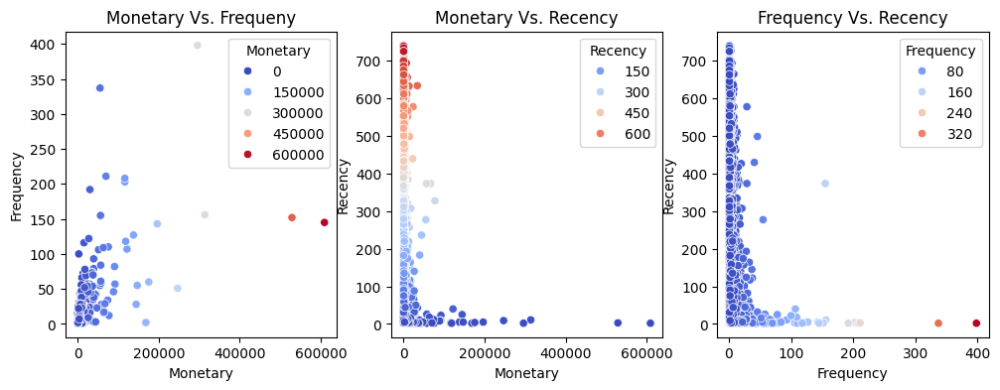
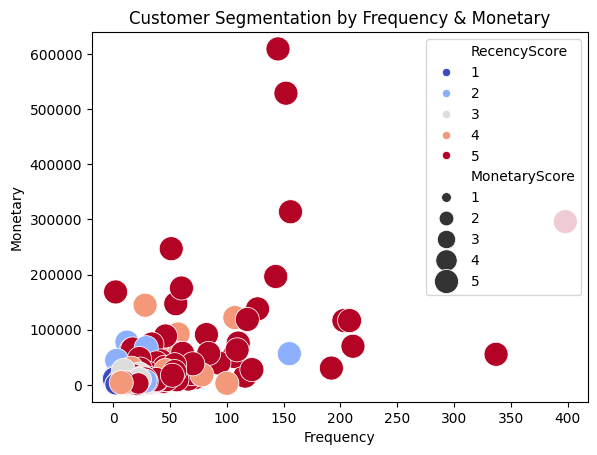
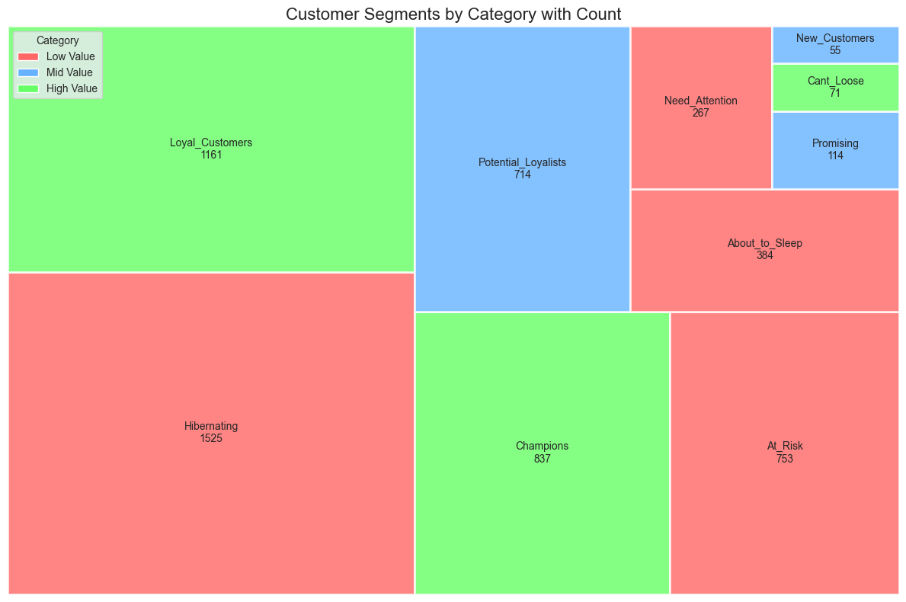
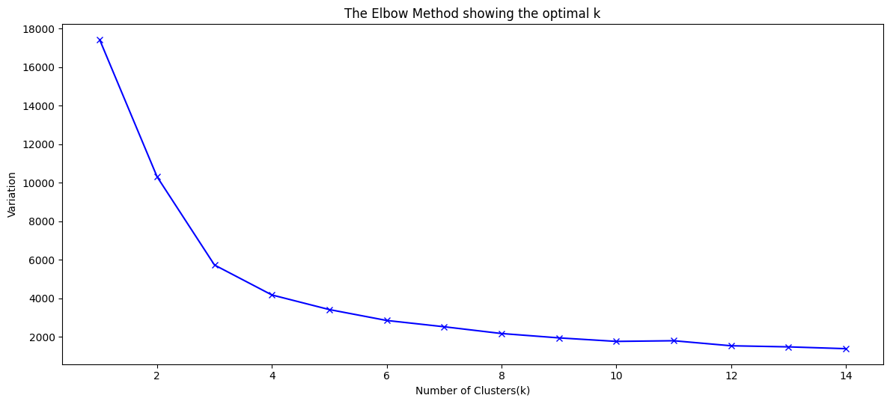
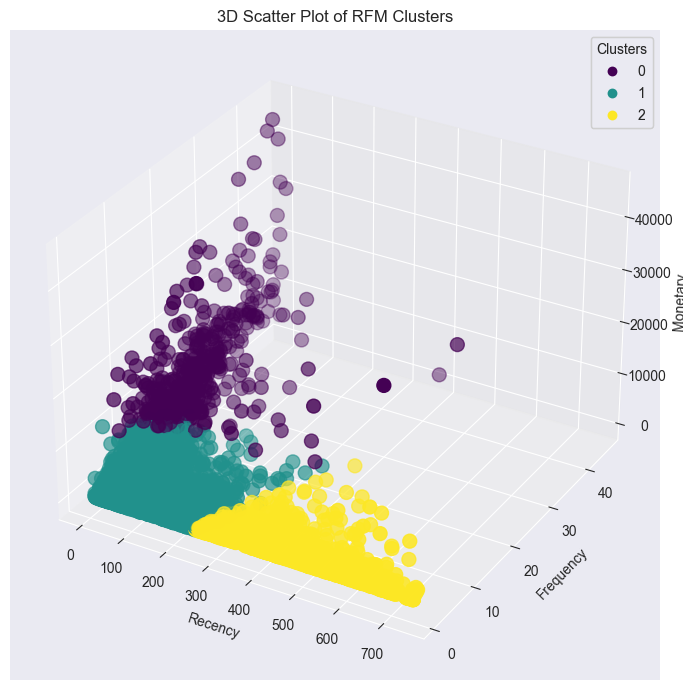
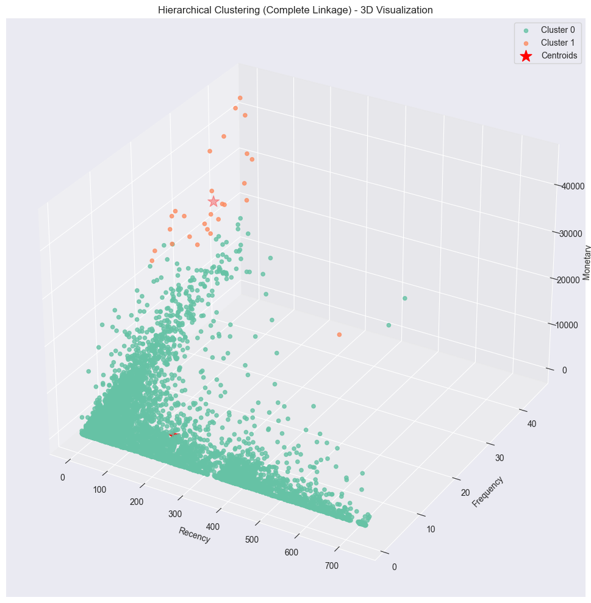

# Customer Segmentation using RFM Analysis

## 📌 Project Overview
This project applies **RFM (Recency, Frequency, Monetary) Analysis** to segment customers based on their purchasing behavior.  
RFM is a well-established marketing technique that helps businesses understand customer value and tailor strategies accordingly.

The analysis is followed by **customer segmentation**, **visualization (TreeMap)**, and **strategic recommendations**.

Also, using the` K-Means`, and `Agglomerative Clustering` Methods the clustering of the customer is done based on RFM data after preprocessing and standardization.

---

## ⚙️ Workflow
1. **Data Preparation**
   - Cleaned and structured transaction data.
   - Calculated **Recency, Frequency, and Monetary (RFM) metrics** for each customer.

2. **RFM Scoring**
   - Assigned scores (1–5) to each RFM metric based on quartiles.
   - Combined into a three-digit RFM score.

3. **Segmentation**
   - Mapped RFM scores to customer segments using regex-based mapping (`seg_map`).
   - Created categories: High Value, Mid Value, Low Value.

4. **Visualization**
- **Plot for Frequency Monetary and Recency**

 This visualization contains three scatterplots that analyze customer behavior using different RFM metric combinations.

**Monetary vs. Frequency (left):** Shows the relationship between spending and purchase frequency. Most customers cluster at low spending and low frequency, while only a few customers with very high frequency also contribute significantly higher spending, highlighting the presence of “VIP” buyers.

**Monetary vs. Recency (middle):** Compares spending against how recently customers purchased. High spenders are generally recent buyers (low recency values), while customers with high recency (not purchased in a long time) tend to spend less, indicating risk of churn.

**Frequency vs. Recency (right):** Illustrates how often and how recently customers purchase. Most high-frequency buyers also have low recency, showing they are active and engaged. Conversely, customers with high recency and low frequency are less engaged and more likely to churn.

Overall, these plots highlight that high-spending, high-frequency, and recent buyers are the most valuable customer segment, whereas those with low frequency and high recency contribute the least and need re-engagement strategies.
   
  
  
   This scatterplot shows customer segmentation using RFM (Recency, Frequency, Monetary) metrics. The x-axis represents purchase frequency, the y-axis shows total spending (monetary value), bubble size reflects the monetary score (spending level), and color indicates recency (how recently they purchased). From the chart, most customers are low-frequency, low-spending buyers clustered in the bottom-left, while a few high-value customers (large red bubbles) appear in the middle and upper-right, showing they buy often, spend more, and are recent. **Some high-spending but blue-colored customers indicate past valuable buyers at risk of churn.** Overall, this chart highlights loyal/high-value customers, at-risk customers, and low-value segments, helping businesses target strategies effectively.
   - Built **TreeMap visualization** to show customer distribution across segments.
   - Color-coded based on value category:
     - 🟩 High Value → Green
     - 🟦 Mid Value → Blue
     - 🟥 Low Value → Red

We can observe the segmented customers along with their count in the above chart.
1. **Analysis & Strategy**
   - Interpreted business meaning of each segment.
   - Suggested marketing strategies: retention, recovery, or conversion.

---

## 📊 Customer Segmentation Analysis (RFM-Based)
| Segment              | Customers | Profile                                | Meaning                                     | Strategy                                                                 |
|----------------------|-----------|----------------------------------------|---------------------------------------------|--------------------------------------------------------------------------|
| **Champions**        | 837       | High Recency, High Frequency, High Monetary | Best customers – recent, frequent, high spenders | Reward with loyalty programs, exclusive offers, early access              |
| **Loyal Customers**  | 1161      | Frequent buyers, steady contributors   | Very engaged but not always high spenders   | Upsell, cross-sell, encourage referrals                                  |
| **Potential Loyalists** | 714    | New/recent customers with strong potential | Could become long-term if nurtured          | Offer incentives, targeted campaigns, personalized experiences           |
| **New Customers**    | 55        | Recent buyers, limited history         | Early engagement crucial for lifetime value | Onboard effectively, educate, build trust                                |
| **Promising**        | 114       | Recently active but low frequency/spend | Engaged but not habitual yet                | Send reminders, personalized deals, loyalty nudges                       |
| **Need Attention**   | 267       | Moderate activity, declining engagement | Slipping customers                          | Re-engagement campaigns, special offers                                  |
| **At Risk**          | 753       | Used to be good customers, now inactive | Risk of churn, lost revenue                 | Win-back campaigns, discounts, feedback                                  |
| **Can’t Lose Them**  | 71        | Previously high spenders, now inactive  | Critical customers to recover               | VIP offers, personal outreach, exclusivity                               |
| **Hibernating**      | 1525      | Very low activity                       | Dormant, minimal revenue                    | Low-cost reactivation campaigns, seasonal offers                         |
| **About to Sleep**   | 384       | Infrequent, not recent, some activity   | On the verge of churn                       | Reminders, limited-time offers, personalized recommendations             |

## 🧭 Strategic Takeaways

- **High Value (Champions, Loyal Customers, Can’t Lose Them):**  
  Focus on **retention & rewards**.

- **Mid Value (Potential Loyalists, Promising, New Customers):**  
  Focus on **growth & conversion to loyalty**.

- **Low Value (At Risk, Need Attention, About to Sleep, Hibernating):**  
  Focus on **recovery & cost-effective reactivation**.

---
## 3D Plot of the Customer Cluster based on RFM using K-Means
- Determining the Optimal `K` Cluster Value  using `Elboww method.`

This analysis applies K-Means clustering on customer RFM (Recency, Frequency, Monetary) data to segment customers into distinct groups. The first chart uses the Elbow Method, where the variance sharply decreases up to around `k=3`, suggesting that 3 clusters provide the optimal balance between accuracy and simplicity. The second chart is a 3D scatter plot of the clusters, where customers are grouped based on their RFM values. The three colors represent different segments: one cluster consists of recent, frequent, and high-spending customers `(loyal/high-value buyers)`, another represents moderate customers with average values, and the last contains inactive or low-value customers with low frequency, low spending, and high recency. 
**Cluster 0 (Purple)** = Low-value / irregular customers
**Cluster 1 (Teal)** = Active, moderate-value customers (growth potential)
**Cluster 2 (Yellow)** = Inactive or churned customers
This clustering helps businesses clearly distinguish between valuable loyal customers, at-risk customers, and low-value groups for targeted strategies.

**Analysis of Hierarchical Clustering (Linkage criteria - average):**

> This plot shows **Hierarchical Clustering (Average Linkage)** on RFM data in 3D, where customers are divided into two clusters. **Cluster 0 (green)** represents the majority of customers who have low spending, purchase less frequently, and show higher recency, making them mostly low-value or inactive customers. **Cluster 1 (orange)**, on the other hand, represents a smaller group of customers with higher monetary values and better frequency and recency, identifying them as high-value, loyal buyers. The **red stars** mark the cluster centroids, which indicate the average position of each group. In short, this clustering highlights a clear separation between high-value loyal customers and the much larger group of low-value customers, helping businesses target strategies more effectively.

- **Analysis of Hierarchical Clustering (Linkage criteria - complete):**

>  This 3D plot shows Hierarchical Clustering (Complete Linkage) on RFM data, dividing customers into two groups. Cluster 0 (green) represents the majority with low-to-moderate frequency, spending, and higher recency → mostly low/mid-value customers. Cluster 1 (orange) represents fewer but high-spending, more loyal customers → the most valuable segment. The red stars mark cluster centroids (average positions). In short, the model separates high-value loyal buyers from the larger group of low-value customers for targeted strategies.

- **Average Vs Complete Linkage**
> In hierarchical clustering, the results differ slightly depending on the linkage method used. With Complete Linkage, the separation between clusters is sharper, clearly isolating high-value customers (Cluster 1) from the majority of low-value customers (Cluster 0). This method produces more compact groups, with centroids spread further apart, making it ideal for identifying elite, high-spending customers versus low-value ones. On the other hand, Average Linkage produces a softer separation, where high-value customers are still grouped together but with more overlap from mid-range customers, resulting in broader and less strict clusters. This makes Average Linkage better suited for balanced marketing segmentation, while Complete Linkage is preferable when the goal is to distinctly target VIP customers.

## 📂 Files in this Project
- `analysis.ipynb` → Jupyter notebook with code and RFM analysis.    
- `Charts` folder → Contains analysis plots and charts
- `README.md` → Documentation of the project.

---

